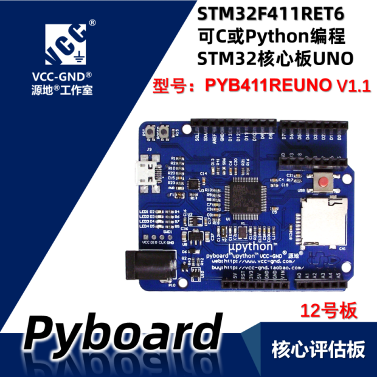
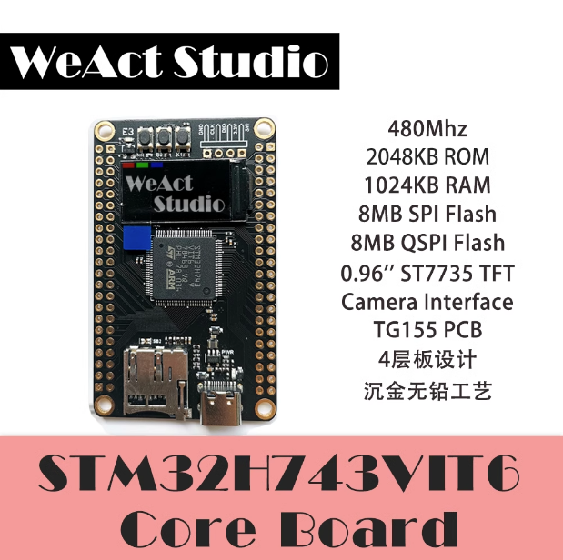
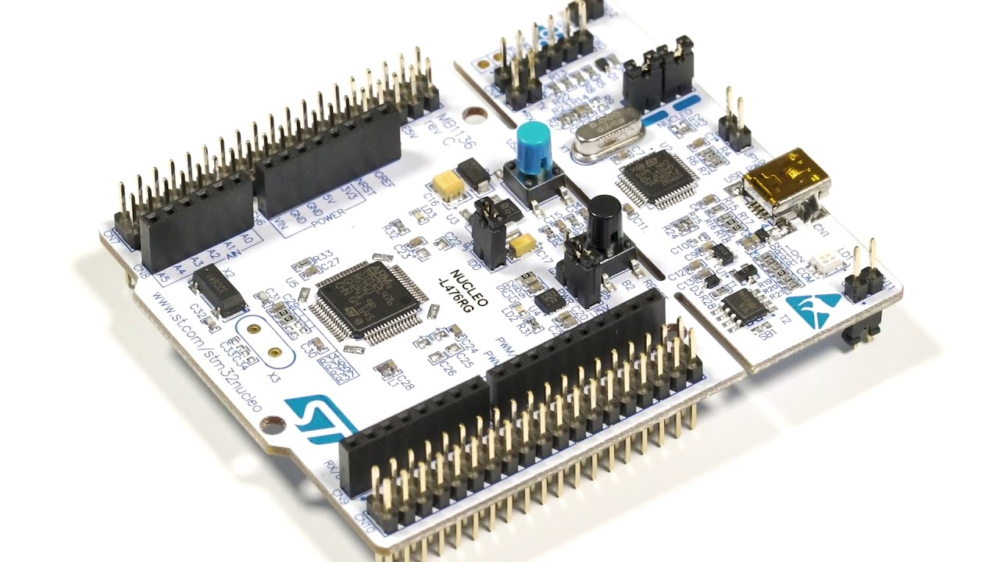

# STM32_MicroPython

## A collection of tools, board definition, custom code etc for MicroPython, focusing on STM32 MCUs.

### Board Definitions

There are a couple of board definitions, and I'll add more every time I experiment with a new (to me) board.

* [WEACT_H743](https://github.com/WeActStudio/MiniSTM32H7xx)
* PYBLITEV10 --> This was tested with the [PYB411RE UNO](https://item.taobao.com/item.htm?spm=a312a.7700824.w4002-6273769129.11.4cf860dcjCPDug&id=612370008756)
The latter has been modified from the original to load the SD card, which wasn't available.

### Builds

I have compiled µP for a few boards, including the nRF52840 – pca100059, working on my Nordic Dongle. The builds include my custom code.

Tested on the above and:

* Nucleo-L476RG: As usual with STM boards, this was a pleasure to code and test on this device.

### Custom code

The `kongduino` module has a few functions, mostly AES-related. You need to add one line in `Makefile` around line 358, to include `kongduino.c` in the compilation process. Included commands so far:

* `crc`: Calculates the CRC32 of a buffer. Original code by Michael Barr. I cut it down to just the CRC32. The idea is to have useful functions without too much overhead.
* `hexdump`: My favorite function to show data that may not be ASCII.
* `reverse_array`: does exactly what it says. Not *very* useful but I wrote that function when I started learning about custom C modules for µP.
* `[de|en]cryptAES_[ECB|CBC]`: AES encryption / decryption, ECB and CBC, of a buffer whose length is a multiple of 16. I will add padding later. For the moment, DIY

*Scripts*

* `test_aes.py`: a demonstration of the aes functions.
* `test_lzw.py`: a demonstration of the `lzw.py` library.
* `lzw.py`: a cut-down implementation of LZW specifically for ASCII (0-127). You can put it in `lib/micropython-lib/python-stdlib` so that it is included in the firmware, and compiled as `lzw.mpy`.

### Tools

* `calculate_crc_table.c`: In the `crc.c` file, there's a function to compute the CRC table. I printed it out and initialize it at compile time, to save space, and improve speed.
* `ziphex.sh`: a bash script to zip the .hex builds, before pushing to GitHub.